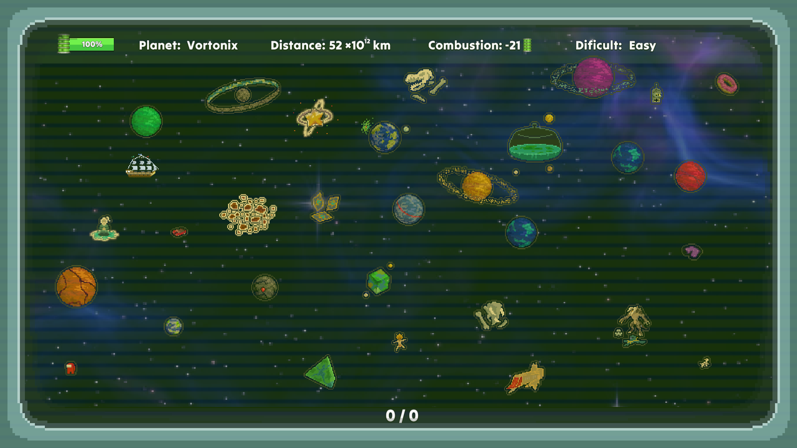
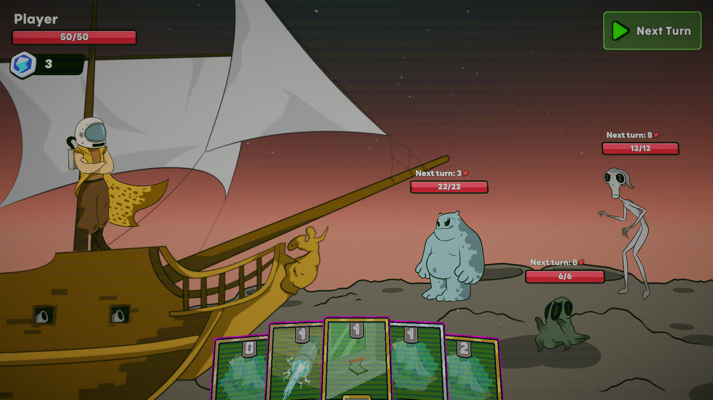
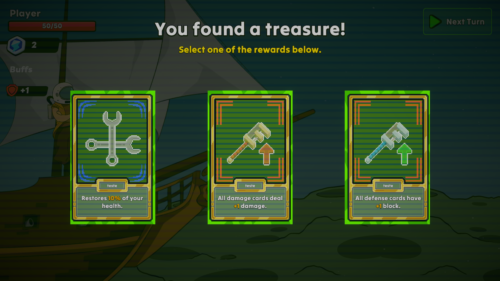

# 🚀 Cosmic Duel

**Cosmic Duel** is a roguelite deckbuilding game set in space, where every jump between planets consumes fuel — and every planet holds a new challenge. Pilot your ship across the galaxy, engage in tactical card-based battles, and optimize your deck to survive the journey.

🎬 [Gameplay video on YouTube](https://www.youtube.com/watch?v=CIL81KBdraE)

## 🪐 Key Features

- **Strategic exploration** – Choose your path carefully as each jump costs fuel.
- **Turn-based card combat** – Use your deck to battle unique enemies on each planet.
- **Roguelite progression** – Each run offers different cards, routes, and challenges.

## 🎮 How to Play

1. Begin with a basic deck and limited fuel.
2. Select which planets to visit, weighing risks and rewards.
3. Fight turn-based duels using your cards and strategy.
4. Win battles to expand and improve your deck.

## 📦 Download

➡️ **[Play Cosmic Duel on itch.io](https://andrecerqueira.itch.io/cosmic-duel)**  
Platform: Windows  
Size: ~41MB  
Free to play

## 👨‍🚀 Development Team

**Game made during IPCA Game Jam 2025 by:**

- 🎮 *André Cerqueira* – Programming  
- 🎨 *André Sampaio* – Art  
- 🔊 *Lara Gaivoto* – Sound  
- 🎨 *Mariana Gregório* – Art  
- 👨‍💻 *Nuno Fernandes* – Programming

## 📸 Screenshots

### Main Menu

### Map

### Battle

### Rewards

---

🎮 Made with love ❤
